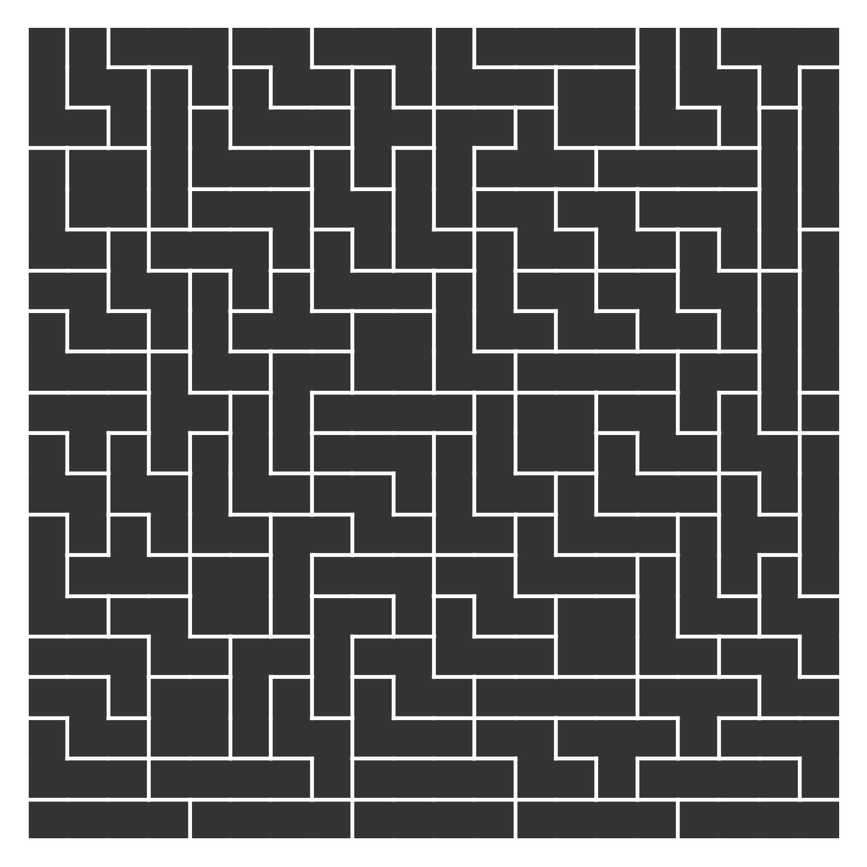

# tetromino_solver

The goal of this project is to provide code to fill an arbitrary grid (around 100x100 or larger where grid size is dividable by 4) with tetrominos as evenly distributed as possible. (To avoid symmetries, trivial solutions, etc.) 

This version is only tested on a M3 Mac with OS 14.3 (23D56) so far. Running it elsewhere will require the compile command in the makefile needs to be adjusted.

## Changelog

- **2024-08-23** - Initial release able to solve 50x50 grids in reasonable time (around 190 seconds). This version includes simple *heuristic ordering*, *backtracking pruning*, *bitwise representation* and *memory optimization via linear arrays*

## Potential Improvement Paths

- profiling to understand bottlenecks (gprof, perf, XCode instruments)
    - reduce function call overheads
- cache heuristics, more advanced heuristics (future placement options, density of occupied cells, connectivity)
- better backtracking
    - early exit conditions
    - constraint propagation or conflict-driven clause learning (CDCL)
- paralellisation with OpenMP 
    - for can_place_tetromino function
    - multi-directional search
    - grid splitting
- alternative algorithms like constraint satisfaction or dynamic programming
- dynamic programming memorization (not impacting the symmetry and shape distribution)